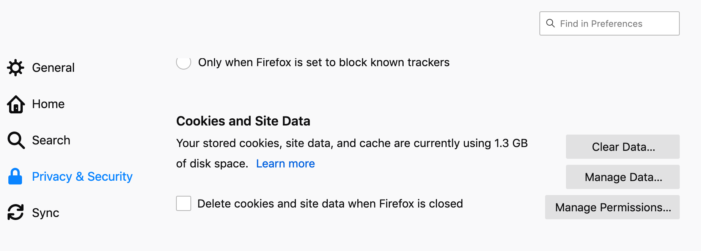
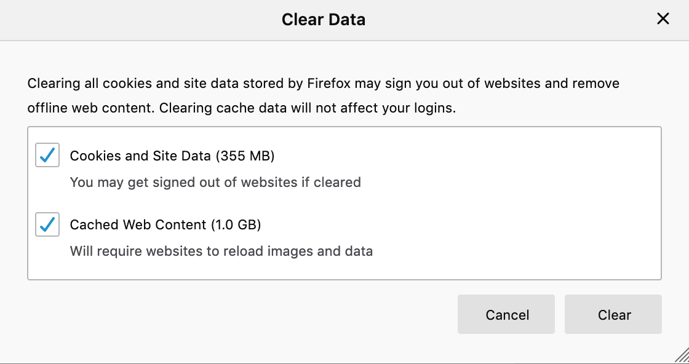
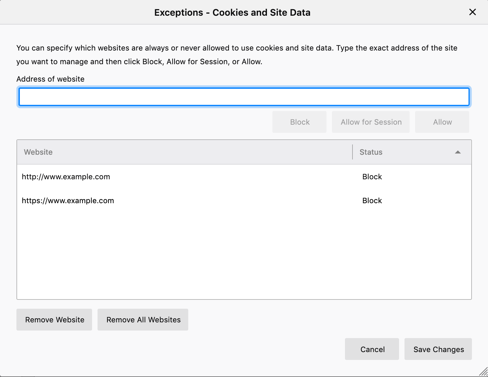
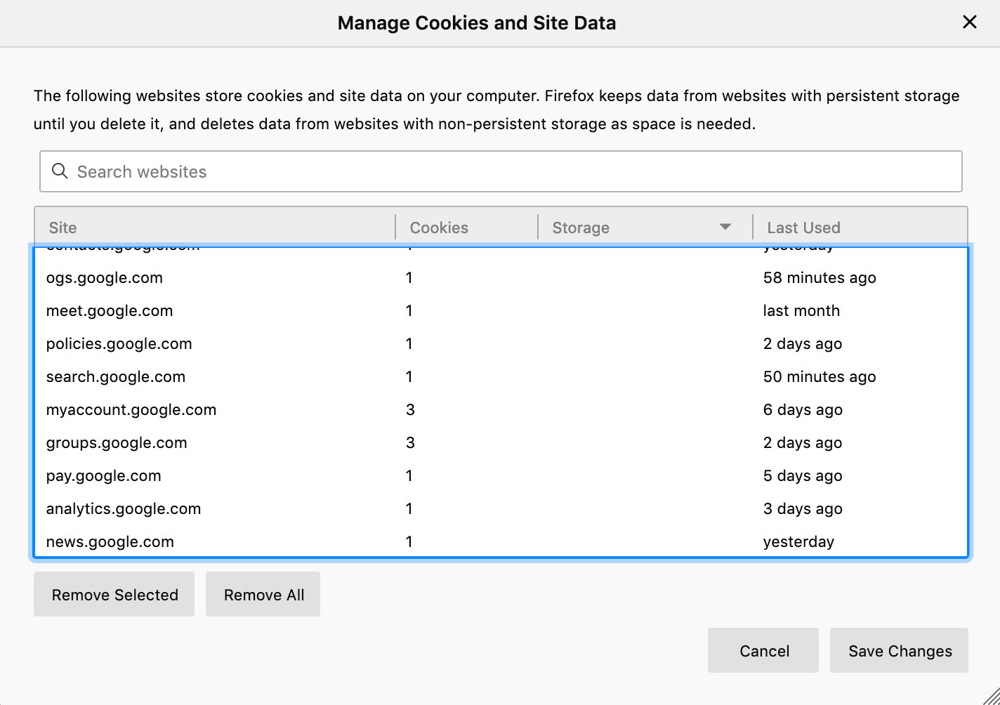
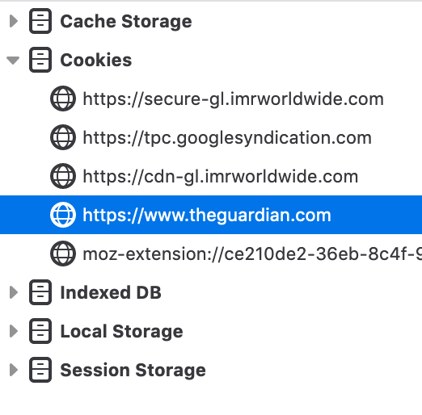
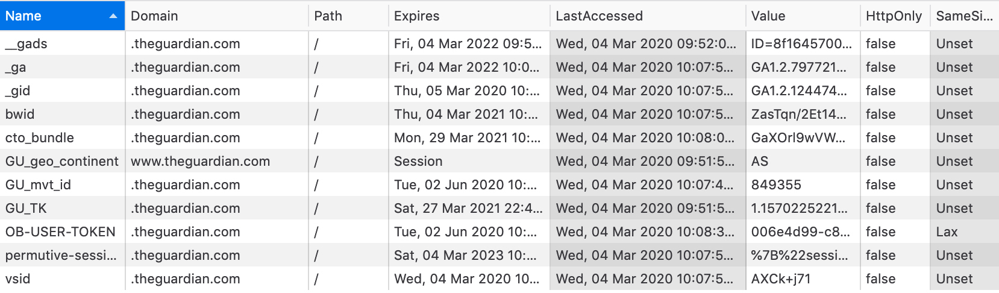
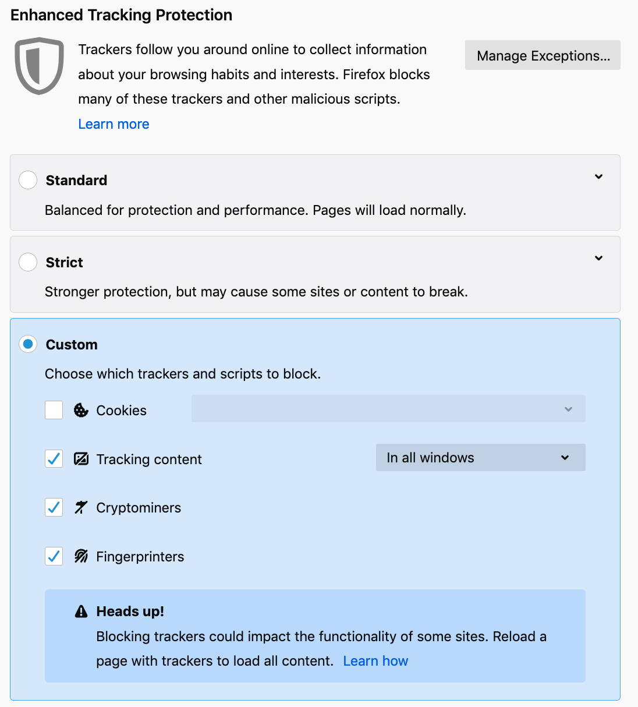
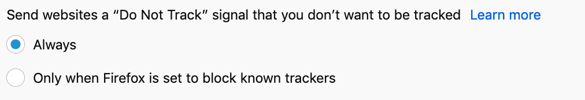

# Controlling cookies in the Firefox web browser

Firefox has good support for controlling cookies. It also has a healthy ecosystem of [Browser Add-ons](../browser-extensions.md) which can add additional capability to controlling cookies.

#### How to clear all cookies in Firefox

1. Click the  menu then click **Preferences**. Or **Firefox -> Preferences** in the macOS menu bar.
2. Navigate to **Privacy & Security -> Cookies and Site Data**
   
3. Click **Clear data...**
   
4. Ensure "Cookies and Site Data" is selected. Click **Clear**
5. You may find you have been signed out of some websites you use, and will need to log in again.

#### How to delete cookies when browser closes in Firefox

1. Click the  menu then click **Preferences**. Or **Firefox -> Preferences** in the macOS menu bar.
2. Navigate to **Privacy & Security -> Cookies and Site Data**
   
3. Check **Delete cookies and site data when Firefox is closed**
   

From now on, every time the browser closes all cookies will be removed. This may mean you need to log in to websites more frequently. You'll be tracked for shorter periods, and save hard drive space.

#### How to block cookies for a specific website in Firefox

One way to do this is via **Preferences**:

1. Click the  menu then click **Preferences**. Or **Firefox -> Preferences** in the macOS menu bar.
2. Navigate to **Privacy & Security -> Cookies and Site Data**
   
3. Click **Manage Permissions...**
4. You will see the **Exceptions** panel - which allows you to set rules for particular websites. These settings will override whatever general settings you have applied.
5. Enter the website domain name in the **Address of website** field at the top. You do not need to enter the *https://**. For example, you can enter **www.example.com" and this will apply to both **http://www.example.com** and https://www.example.com**.
6. Choose **Block**, and the website is added to the list.
   
7. Click **Save Changes**, and now the website will not be allowed to set cookies or site data on your computer.

Beware, doing this can break some websites!

### How to view the number of cookies per website in Firefox

1. Click the  menu then click **Preferences**. Or **Firefox -> Preferences** in the macOS menu bar.
2. Navigate to **Privacy & Security -> Cookies and Site Data**
   
3. Click **Manage Data...**
4. You can find the website in the list or search for it.
5. Next to **Site**, you will see **Cookies** (number of cookies), **Storage** (space used by cookies / site data), and **Last Used**.
   

### How to view cookie data via in Firefox

In Firefox Preferences, you view the number of cookies per website but not the cookie data itself.

However, it is possible to view cookie data using the Web Inspector:

1. Navigate to the website you wish to view cookie data for. Note that doing this may lead to new cookies being set by the website.
2. Click the  menu then click **Web Developer**, then **Storage Inspector**. You can also find this via teh **Tools** menu on macOS.
3. Ensure **Cookies** is open on the left.
4. Under **Cookies** you will see each of the domains that were loaded for the current webpage, and which have set cookies. This includes third-party cookies (unless you have blocked them).
   
5. Click on one of the domains shown. You will see the cookies for that domain on the right. For each domain you can see:
    - **Name** - the key use to define this cookie.
    - **Domain** - the domain name the cookie was from.
    - **Path** - the path the cookie applies to (typically `/`, which means all pages on the website).
    - **Expires** - the date and time that the cookie will no longer be accessible
    - **LastAccessed** - the date and time that the cookie was last updated.
    - **Value** - the data stored in the cookie. This will often be some unique identifier, so it may not mean much to you.
    - **HttpOnly** - an optional property of cookies used to stop the cookie being access via JavaScript.
    - **SameSite** - an optional property of cookies used by some websites to enhance security.
  

### How to delete cookies for a specific website in Firefox

1. Click the  menu then click **Preferences**. Or **Firefox -> Preferences** in the macOS menu bar.
2. Navigate to **Privacy & Security -> Cookies and Site Data**
   
3. Click **Manage Data...**
4. You can find the website in the list or search for it.
   
5. Select the website domain you wish to remove cookies for.
6. Click *Remove* - all cookies and site data for that domain will be removed

Beware that many websites load third party domains which set cookies, and you would need to search and remove these separately, and it may be almost impossible to identify all the third party domains that have been loaded previously. It is therefore more effective to use some form of tracking protection against third-party cookies.

### Enable Tracking Protection in Firefox

Firefox has in-built tracking protection for Cookies and various other techniques (Tracking content, Cryptominers, and Fingerprinters). It is likely that you can get better tracking protection via the user of [Browser Add-ons](../browser-extensions.md), but the in-built tracking protection is a reasonable option.

To enable tracking protection:

1. Click the  menu then click **Preferences**. Or **Firefox -> Preferences** in the macOS menu bar.
2. Navigate to **Privacy & Security -> Enhanced Tracking Protection**
3. You can select **Standard**, **Strict**, or **Custom** tracking protection.
    - **Standard** is a good option for most users if not installing a Browser Add-on
    - **Strict** could be good for more advanced users who will recognise if the tracking protection has broken a website.
    - **Custom** is a good option if you will be using Browser Add-ons to provide tracking protection. It may then be best to disable some of the in-built tracking protections in order to improve performance and allow the plugins to perform these functions instead.
  

### Enable “Do Not Track” signal in Firefox

1. Click the  menu then click **Preferences**. Or **Firefox -> Preferences** in the macOS menu bar.
2. Navigate to **Privacy & Security -> Enhanced Tracking Protection** and scroll down
3. Select **Always**.
  

### Next steps

Now that you've mastered the cookie controls in Firefox, you may also like to consider [Browser Add-ons](../browser-extensions.md) to add further privacy protection.

